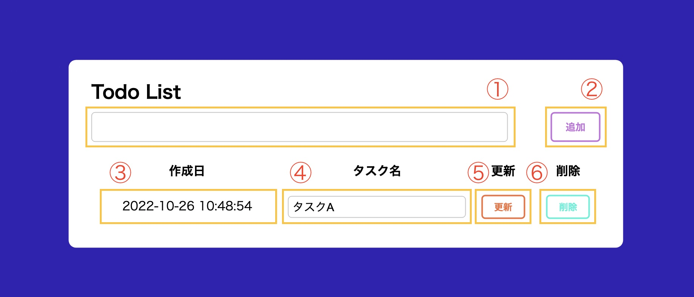
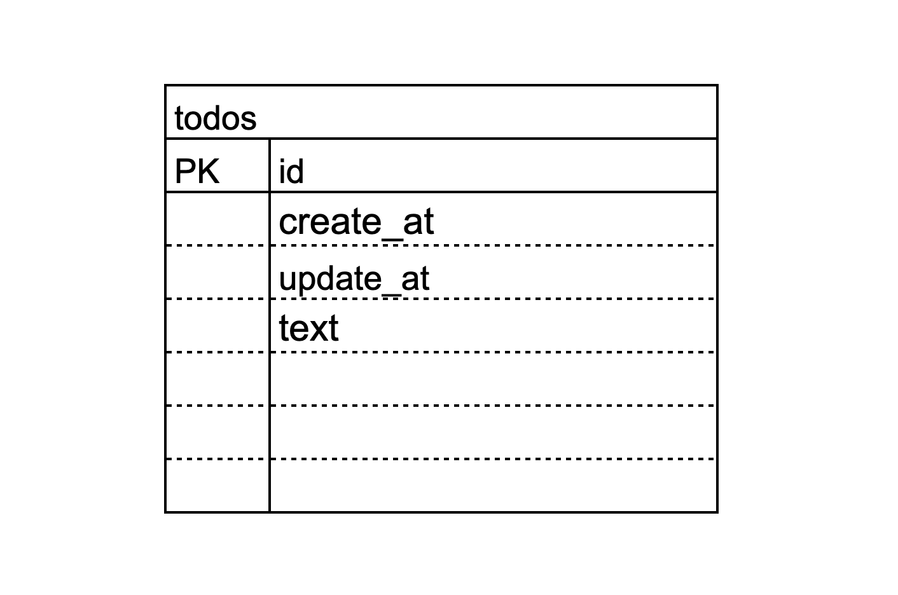

# Todo 管理アプリ

## 1. 概要説明（どんなアプリか）

 

#### ▼ 概要

| No  | 項目名     | 項目種類 | 説明                                        |
| :-- | :--------- | :------- | :------------------------------------------ |
| ①   | Todo 名    | TextBox  | Todo を新規作成するための Todo 名を入力する |
| ②   | 作成ボタン | Button   | Todo の新規作成を実行する                   |
| ③   | 作成日     | Text     | Todo の日付を表示                           |
| ④   | Todo 名    | TextBox  | Todo を更新するための Todo 名を表示         |
| ⑤   | 更新ボタン | Button   | Todo の更新を実行する                       |
| ⑥   | 削除ボタン | Button   | Todo の削除を実行する                       |

 

## 2. 作成した目的

日々の Todo 管理のため

 

## 3. 機能一覧

-   Todo の新規追加
-   Todo の更新
-   Todo の削除

 

## 4. 使用技術（実行環境）

-   Laravel 8.83.25

 

## 5. テーブル設計

| カラム名  |     型      | Primary Key | Unique Key | Not Null | Foreign Key |     others     |
| :-------: | :---------: | :---------: | :--------: | :------: | :---------: | :------------: |
|    id     | bigint(20)  |      ○      |            |    ○     |             | AUTO_INCREMENT |
| create_at |  timestamp  |             |            |          |             |                |
| update_at |  timestamp  |             |            |          |             |                |
|   text    | varchar(20) |             |            |    ○     |             |                |

 

## 6. ER 図

 

 

## 7. その他

-   Todo 名は1文字以上20文字以下であること
